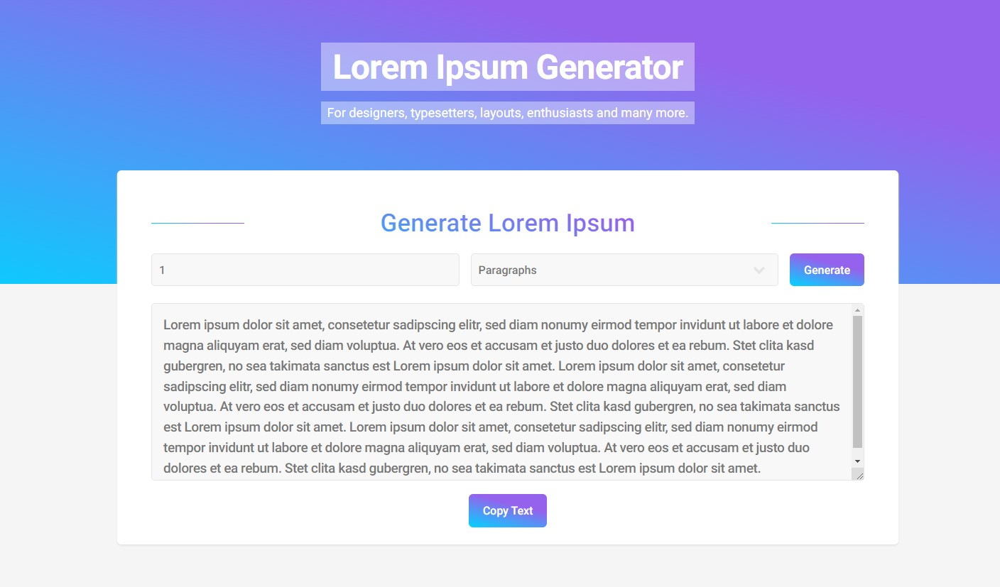

# Lorem Ipsum Generator



## Table of Contents

- [Introduction](#introduction)
- [Features](#features)
- [Prerequisites](#prerequisites)
- [Installation](#installation)
- [Usage](#usage)
- [Technologies Used](#technologies-used)
- [Contributing](#contributing)

## Introduction

The **Lorem Ipsum Generator** is a web application built with React and Vite that allows designers, developers, and anyone else in need of placeholder text to generate lorem ipsum content easily. You can generate content by the number of paragraphs, words, or characters.

## Features

- Generate lorem ipsum text by:
  - Paragraphs
  - Words
  - Characters
- User-friendly interface with a modern design
- Instant text generation

## Prerequisites

Before you begin, ensure you have the following installed on your machine:

- Node.js (v14 or later)
- npm (v6 or later)

## Installation

To run this project locally, follow these steps:

1. Clone the repository:
   ```bash
   git clone https://github.com/salahghr4/lorem-ipsum-generator.git
   ```
2. Navigate to the project directory:
   ```bash
   cd lorem-ipsum-generator
   ```
3. Install the dependencies:
   ```bash
   npm install
   ```
4. Start the development server:
   ```bash
   npm run dev
   ```

## Usage

1. Open your browser and go to `http://localhost:5173`.
2. Select the type of lorem ipsum you want to generate (paragraphs, words, characters).
3. Input the desired quantity.
4. Click the **Generate** button.
5. Copy the generated text as needed.

## Technologies Used

- **React**: JavaScript library for building user interfaces.
- **Vite**: Frontend build tool for faster and leaner development.
- **CSS**: Styling the application.
- **JavaScript**: Adding interactivity and functionality.

## Contributing

Contributions are welcome! If you have suggestions for improvements or new features, feel free to fork the repository and submit a pull request.
